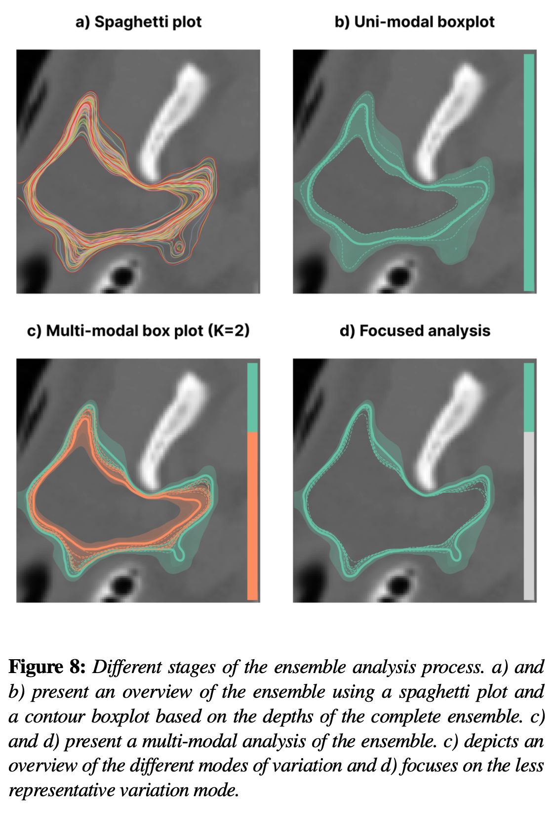

# Multimodal Depth for Contour Ensembles

[](https://opensource.org/licenses/MIT)

Code for the paper Depth for Multi-Modal Contour Ensembles.

This repository contains the code for the paper:
> Chaves-de-Plaza, N.F., Mody, P., Staring, M., van Egmond, R., Vilanova, A., Hildebrandt, K., Inclusion Depth for Contour Ensembles, 2024, EuroVis 2024 (under revision).



If you use our code in your publications, please consider citing:
```
@article{chavesdeplaza2024multimodaldepth,
    title={Depth for Multi-Modal Contour Ensembles},
    author={Chaves-de-Plaza, Nicolas and Molenaar, Mathijs and Mody, Prerak and Staring, Marius and van Egmond, Ren\'{e} and Eisemann, Elmar and Vilanova, Anna and Hildebrandt, Klaus},
    journal={TODO},
    year={2024},
    volume={TODO},
    number={TODO},
    pages={TODO},    
    doi={TODO},
    eprint={TODO}
}
```

[Future link to paper]

Also, consider checking the paper where we introduce the [Inclusion Depth for Contour Ensembles](https://graphics.tudelft.nl/inclusion-depth-paper). And, if you want to integrate contour depth in your project, check out the [`contour-depth` Python package](https://graphics.tudelft.nl/contour-depth).

## Setup
1. Install a conda (we recommend using [miniconda](https://docs.conda.io/projects/miniconda/en/latest/))
2. Create environment: `conda create --name=multimodal-depth python=3.9.18`
3. Activate environment: `conda activate multimodal-depth`
4. Install dependencies with pip: `pip install -r requirements.txt`
5. To test installation, from the root of the repository run `python -c "from src.depths.inclusion_depth import compute_depths"`. No errors should be raised.

## Replicating the paper results
The scripts in the `experiments` directory permit replicating the paper's results.
Each script corresponds to a figure or table in the paper. Each script generates its data, results, and figures or tables. The script saves these outputs to a directory with the same name in the `experiments` directory. For instance, running the command `python clustering_differences.py` results in a directory `experiments/clustering_differences`.
Data for the case studies is available from the authors upon request. 

## License and third-party software
The source code in this repository is released under the MIT License. However, all used third-party software libraries are governed by their own respective licenes. Without the libraries listed in `requirements.txt`, this project would have been considerably harder.
