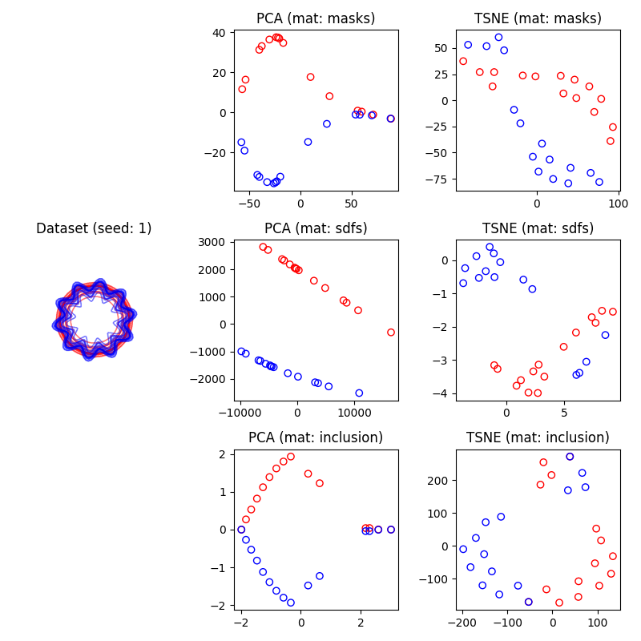

# Preliminary results

This folder includes preliminary results for the paper.

## Testing shape families assumption

One of the assumptions I had was that clustering would be able to disentangle two overlaping families of shapes.
To verify this, I computed the depths of the GT, predicted and random labellings (IMAGE).
The results show that with the strict depths, there maximum cost is attained by the GT, which suggests that depths can help split it.
Interestingly, this was not the case with the modified depths, which hinted at a limitation of these depths.

**Implications**: I need to find examples that allow me to illustrate the functioning of ddclust. 
It seems the best way to do it is to start from the examples in the paper, which concerns multi-dimensional points, and think of contour ensembles that, when reduced, would yield such point clouds.

IMAGE

# Validating separability of clusters

To further understand if clustering would be effective at separating the main contour groups, I inspected a lower dimensional representation of the contours.
Specifically, I reduce the domensionality of the matrix associated to the contours to 2 dimensions using PCA and TSNE and visualized the embedding using a scatter plot.
I visually evaluated the separability of the clusters on these scatterplots for three matrices: flattening masks, flattening sdf of masks and inclusion matrix.

**Implications**: Read the implications for 'Testing shape families assumption'.

